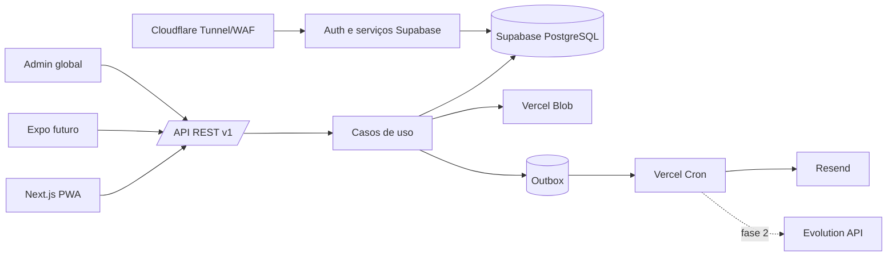

# PRD do MVP — AC Fitness

**Versão:** 1.0

**Data-base técnica:** 17 de agosto de 2026

**Status:** decisões de produto e arquitetura aprovadas durante o processo de definição

Legenda:

- **Decisão:** requisito confirmado.
- **Recomendação:** desenho proposto para implementação.
- **Hipótese:** precisa ser validada no piloto.
- **Obrigação de lançamento:** bloqueia produção se não estiver atendida.

---

## 1. Resumo executivo do produto

O AC Fitness será uma plataforma SaaS para personal trainers prescreverem, distribuírem, ajustarem e acompanharem treinos. O mentorado utilizará prioritariamente o celular; o personal terá um painel administrativo responsivo, adequado também a desktop.

O ciclo central do MVP é:

1. personal cadastra ou convida o mentorado;
2. cria uma ficha diretamente ou a partir de um modelo;
3. publica uma versão imutável;
4. o mentorado executa e registra o realizado;
5. o personal identifica aderência, dificuldades e evolução;
6. alterações futuras geram nova versão, preservando o histórico.

| Dimensão | Decisão |
|---|---|
| Lançamento inicial | PWA responsiva, sem lojas |
| Arquitetura | Next.js 16.2 + React 19.2 no web; Expo SDK 56 posteriormente |
| Backend | API REST modular em Next.js + Supabase auto-hospedado |
| Banco | PostgreSQL com RLS e isolamento por tenant |
| Arquivos | Vercel Blob público e privado |
| Infraestrutura de dados | VPS ProfRamos, em projeto Docker isolado |
| Piloto | 5 personais e até 50 mentorados |
| Escala de desenho | 100 personais, 5.000 mentorados e cerca de 1.000 inícios de sessão/dia |
| Prazo estimado | 20–24 semanas, aproximadamente 15 horas semanais |
| WhatsApp | Evolution API/Baileys somente na fase 2 |
| Público | Maiores de 18 anos |
| Localização | pt-BR e sistema métrico |

A arquitetura preserva API, banco, contratos, validações e regras de negócio para o futuro aplicativo nativo. A interface não será integralmente compartilhada: web administrativa e aplicativo nativo exigem componentes próprios.

## 2. Problema, público-alvo e proposta de valor

### Problema

Planilhas, PDFs e mensagens provocam perda de histórico, baixa visibilidade sobre o realizado, retrabalho na reutilização de treinos e pouca rastreabilidade das mudanças solicitadas.

### Público-alvo

- **Primário:** personal trainer independente atendendo individualmente de 5 a 100 mentorados.
- **Secundário:** adulto orientado por esse personal, treinando em academia, condomínio, residência ou ambiente externo.

Academias, clínicas, equipes multidisciplinares, nutricionistas e grandes redes não integram o primeiro público.

### Proposta de valor

> O personal mantém a prescrição sob controle e acompanha o que aconteceu; o mentorado sabe exatamente o que fazer e registra o treino com o mínimo de atrito.

### Hipóteses do piloto

- Personais conseguem publicar a primeira rotina sem treinamento individual.
- O registro por série substitui adequadamente planilhas e mensagens.
- Alertas simples são mais acionáveis que dashboards extensos.
- O mentorado aceita registrar carga, repetições e esforço durante o treino.
- Preservar versões reduz dúvidas e retrabalho.

## 3. Premissas adotadas

| Tema | Premissa |
|---|---|
| Modelo | SaaS multi-tenant desde o início |
| Tenant | Um espaço isolado por personal no MVP |
| Relacionamento | Um mentorado possui somente um personal ativo; vínculos anteriores são históricos |
| Administração | Administrador global separado do painel do personal |
| Dispositivos | Mobile-first para mentorado; responsivo para personal |
| Agenda | Prescrição por dia e período opcional; sem agenda de compromissos |
| Semana | Segunda-feira 00h até domingo 23h59, no fuso do mentorado |
| Plano | Um plano principal ativo por mentorado |
| Vigência | Início livre, recomendação de quatro semanas e máximo inicial de 16 semanas |
| Modalidades | Musculação, funcional e cardio simples |
| Prescrição | Métricas fixas combináveis, sem fórmulas personalizadas |
| Offline | Execução ativa parcialmente offline; conteúdo não carregado exige internet |
| Sessão concluída | Imutável para o mentorado |
| Concorrência | Uma sessão editada por um dispositivo; segundo dispositivo exige tomada explícita |
| Dados clínicos | O produto não será prontuário médico |
| Legal | Dor, restrições e condicionamento são tratados como dados sensíveis |
| Equipe | Desenvolvimento solo com Codex |
| Operação | Backup restaurável é bloqueador de produção |
| Tema visual | Claro no MVP; escuro na versão 1.1 |

## 4. Definição objetiva do MVP

O MVP deve permitir que um cliente real solicite acesso, convide um mentorado, crie e publique um plano semanal, acompanhe a execução, receba solicitações de mudança e publique nova versão sem alterar o passado.

### Estados principais

- **Vínculo:** `convite_pendente`, `ativo`, `inativo`, `encerrado`.
- **Plano:** `rascunho`, `agendado`, `ativo`, `encerrado`, `arquivado`, `cancelado`.
- **Versão:** `rascunho`, `publicada`, `cancelada`. Publicada nunca é editada.
- **Ocorrência:** `programada`, `iniciada`, `concluída`, `concluída_com_atraso`, `não_realizada`, `cancelada`, `excluída_por_pausa`.
- **Sessão:** `em_andamento`, `concluída`, `abandonada`, `reaberta`.

### Aderência

```text
aderência = ocorrências concluídas válidas / ocorrências previstas encerradas
```

- A semana atual aparece como parcial.
- Treino atrasado na mesma semana conta como realizado.
- Depois do fechamento semanal, execução tardia é atividade extra.
- Extras não aumentam a aderência.
- Pausas e cancelamentos justificados saem do denominador.
- Sessão abandonada não é concluída.

## 5. Funcionalidades obrigatórias

### 5.1 Autenticação e perfis

- solicitação pública de acesso para personal e aprovação manual;
- e-mail e senha, recuperação e ativação por convite;
- convite válido por sete dias; reenvio invalida o anterior;
- personal pode preparar o plano antes da ativação;
- TOTP obrigatório para administrador e opcional para personal;
- revogação de todas as sessões;
- sessão geral de até 30 dias;
- reautenticação administrativa após 12 horas;
- autorização por papel e por recurso.

### 5.2 Gestão de mentorados

Obrigatórios: nome, e-mail, fuso e situação do vínculo.

Opcionais: objetivos, restrições funcionais declaradas, limitações, equipamento, observações e telefone com consentimento.

Ficam excluídos: diagnóstico, CID, exames, medicamentos, laudos, anamnese clínica extensa e nutrição.

O personal poderá cadastrar, convidar, editar, inativar, consultar planos e execuções, acompanhar aderência, responder mudanças, registrar notas e exportar dados. Cadastros com histórico não são excluídos diretamente.

### 5.3 Biblioteca de exercícios

| Tipo | Visibilidade | Administração |
|---|---|---|
| Padrão | Todos os personais | Administrador global |
| Personalizado | Somente o tenant | Personal proprietário |

Campos: nome, descrição, grupo muscular, categoria, equipamento, instruções, observações, métricas compatíveis, imagem, URL externa de vídeo, status, escopo e origem.

Regras:

- pesquisa normalizada, filtros e ordenação;
- duplicidade provável gera aviso;
- nomes exatamente iguais não se repetem entre privados ativos do mesmo personal;
- item referenciado somente pode ser arquivado;
- exercício privado nunca utilizado pode ser excluído;
- um tenant nunca acessa exercício privado de outro.

A base de aproximadamente 1.200 exercícios será importada como rascunho administrativo. Cerca de 200 itens serão inicialmente traduzidos, revisados e publicados. A prova de autorização comercial deve ser arquivada antes da publicação.

### 5.4 Criação de treinos

O personal poderá criar, duplicar, reutilizar modelo, dividir em sessões, indicar dia e período, ordenar, agrupar, atribuir em lote, pré-visualizar, salvar rascunho, publicar, pausar e arquivar.

Métricas combináveis:

- séries;
- repetições ou faixa;
- carga;
- duração;
- distância;
- descanso;
- cadência;
- intensidade;
- RPE;
- até a falha;
- observação;
- uma alternativa com prescrição própria.

Não haverá métrica personalizada no MVP.

### 5.5 Versionamento

- rascunho é editável;
- publicação cria versão imutável;
- correção ou mudança recorrente cria nova versão;
- versão futura pode ser cancelada, não editada;
- sessão iniciada permanece na versão anterior;
- ocorrência futura não iniciada usa a nova versão na vigência;
- exercícios e instruções são preservados por snapshot.

### 5.6 Área do mentorado

O mentorado poderá ver o treino do dia, iniciar, navegar fora da ordem, registrar ou confirmar séries, adicionar extras, omitir série, usar alternativa prescrita, informar dor/dificuldade, usar cronômetro, concluir com divergências, consultar histórico e solicitar mudanças.

Concluir com pendências exige resumo, confirmação e marcação explícita como não realizado. O motivo é obrigatório quando um exercício inteiro é omitido.

### 5.7 Exceções

| Situação | Comportamento |
|---|---|
| Sai da tela | Sessão permanece recuperável |
| Não retorna em 24h | Aplicativo pergunta se deseja continuar ou abandonar |
| Sem ação por 7 dias | Sessão vira abandonada |
| Perde conexão | Gravações entram em fila local ordenada |
| Faz valores diferentes | Salva realizado sem alterar prescrição |
| Faz na mesma semana | Concluída com atraso |
| Faz após fechar semana | Atividade extra |
| Repete treino | Nova sessão extra |
| Edita concluída | Solicita correção |
| Personal reabre | Até 24h, com motivo e auditoria |
| Segundo dispositivo | Leitura ou tomada explícita |
| Conflito | Resposta `409`, sem merge silencioso |

### 5.8 Cronômetro

Inicia após confirmar série, aceita pausa, reinício, acréscimo e descarte. Guarda horário absoluto de término e recalcula quando a tela volta. Wake Lock, som e vibração são melhores esforços; não se promete alerta confiável com navegador bloqueado.

### 5.9 Dor e dificuldade

Níveis: leve, moderada e severa. Dor severa interrompe o exercício, recomenda encerrar e buscar avaliação quando necessário, gera alerta imediato e exige confirmação para continuar. Não há diagnóstico.

Alertas: `novo`, `visualizado`, `resolvido`, `duplicado`. Resolver exige breve providência.

### 5.10 Solicitações de mudança

Tipos: exercício inadequado, dificuldade, dor, falta de equipamento, troca de dia, troca de período e outro.

```text
aberta -> em análise -> resolvida | recusada
```

O mentorado pode cancelar enquanto aberta. A solicitação nunca altera o plano automaticamente; a resolução aponta para troca pontual, alternativa, nova versão ou orientação.

### 5.11 Painel do personal

Indicadores: mentorados ativos, previstos, concluídos, não realizados, última atividade, aderência em quatro semanas, alertas, solicitações, ausência e últimas cargas/repetições/RPE. Filtros: semana atual, quatro e doze semanas.

Não haverá previsão de lesão, score proprietário, 1RM estimado, recomendação automática ou relatórios avançados.

### 5.12 Administrador global

- pesquisa, contagem, aprovação e suspensão de personais;
- administração da biblioteca padrão;
- visão de falhas, filas, integrações e auditoria;
- sem edição de ficha, acesso rotineiro a conteúdo sensível ou impersonação.

Na suspensão, sessões do personal são revogadas, novos treinos são bloqueados e mentorados mantêm histórico/exportação. Sessão já iniciada pode ser concluída por até duas horas.

### 5.13 Notificações do MVP

- mentorado: e-mail opcional às 8h locais, no máximo um por dia;
- personal: dor severa, solicitação, ativação e ausência;
- resumo opcional às 18h quando houver novidades;
- conteúdo de e-mail sem informação sensível;
- processamento por janela e idempotência, pois Cron não garante o minuto exato.

## 6. Funcionalidades pós-MVP

### Versão 1.1

- tema escuro;
- Evolution API inicial;
- relatórios simples;
- biblioteca ampliada;
- melhorias derivadas do piloto;
- push web apenas se confiável;
- ajustes administrativos de sessão;
- maior suporte a cardio.

### Versão 2.0

- Expo para iOS e Android;
- push e background nativos;
- múltiplos profissionais;
- cobrança SaaS;
- periodização avançada;
- wearables e integrações selecionadas;
- organizações e números de WhatsApp por tenant, se sustentáveis.

## 7. Funcionalidades explicitamente excluídas

| Exclusão | Motivo |
|---|---|
| Pagamentos | Não valida o fluxo central |
| Marketplace | Introduz aquisição e reputação |
| Nutrição | Novo domínio regulatório |
| Videochamada | Alto custo e baixa relação com a hipótese |
| Chat em tempo real | Moderação, retenção e notificações complexas |
| IA | Desnecessária para validar o produto |
| Wearables/academias | Dependências prematuras |
| Gamificação/ranking | Privacidade e risco de distorção |
| Lojas no MVP | A PWA atende ao lançamento |
| Relatórios avançados | Poucos dados iniciais |
| Periodização sofisticada | Amplia demais o domínio |
| WhatsApp no MVP | Integração complementar |
| Múltiplos profissionais | Complica propriedade e autorização |
| White label | Multiplica operação e design |
| Agenda por hora | O produto não é agenda |
| Prontuário médico | Alto risco sem validar o valor central |

## 8. Perfis de usuário e permissões

| Recurso | Admin global | Personal | Mentorado |
|---|---:|---:|---:|
| Aprovar/suspender personal | Sim | Não | Não |
| Exercícios padrão | Administrar | Ler | Ler prescritos |
| Exercício privado de outro tenant | Não | Não | Não |
| Exercício privado próprio | Não | Administrar | Não |
| Mentorados | Não | Administrar no tenant | Próprio perfil |
| Plano | Não | Administrar | Ler próprio |
| Sessão | Não | Acompanhar/reabrir | Executar |
| Notas privadas | Não | Sim | Não |
| Exportação | Dados administrativos | Tenant | Próprios dados |
| Impersonação | Não | Não | Não |

O papel nunca basta sozinho: toda operação exige relação válida com o recurso.

## 9. Jornadas principais

1. **Entrada do personal:** solicitar acesso, aprovação, ativação, segurança e onboarding.
2. **Convite:** criar mentorado pendente, preparar plano, enviar convite e ativar.
3. **Publicação:** criar sessões, prescrever, ordenar, pré-visualizar e publicar.
4. **Execução:** iniciar, registrar séries, usar cronômetro, sincronizar e concluir.
5. **Mudança:** solicitar, analisar, alterar ocorrência ou publicar nova versão e resolver.
6. **Acompanhamento:** identificar alerta, consultar histórico e agir.
7. **Correção:** solicitar, reabrir em 24h, corrigir e concluir nova revisão.

## 10. Histórias de usuário com critérios de aceite

| História | Critérios de aceite |
|---|---|
| Convidar mentorado | Link único, 7 dias, reenvio invalida anterior |
| Preparar antes da ativação | Plano existe, mas execução permanece bloqueada |
| Duplicar modelo | Cópia independente |
| Combinar métricas | Apenas campos aplicáveis; sem negativos |
| Publicar ficha | Versão imutável e ocorrências geradas |
| Mudar ficha | Passado preservado e futuro na nova versão |
| Ver treino do dia | Respeita fuso, período e pausas |
| Registrar conforme prescrito | Uma ação, ainda ajustável |
| Registrar divergência | Prescrito e realizado ficam distintos |
| Continuar offline | Sessão carregada sobrevive a reload |
| Pular exercício | Confirmação e justificativa aplicável |
| Trocar exercício | Somente alternativa prescrita |
| Relatar dor | Nível registrado; severa alerta imediatamente |
| Consultar aderência | Extras e pausas tratados corretamente |
| Resolver solicitação | Estado, resposta e alteração auditados |
| Exportar dados | ZIP com CSV/JSON e link de 24h |
| Suspender personal | Acesso revogado e histórico preservado |
| Evitar duplicidade offline | Idempotência impede registros duplicados |

## 11. Mapa de telas

### Personal

| Tela | Objetivo e ações | Estados/responsividade |
|---|---|---|
| Login | Entrar, recuperar e TOTP | Erro neutro; card central |
| Dashboard | Indicadores, alertas e atividades | Onboarding vazio; grade vira cartões |
| Mentorados | Buscar, convidar e inativar | Tabela vira cartões; skeleton |
| Cadastro | Dados mínimos, objetivos e limitações | Validação inline; uma coluna no mobile |
| Perfil | Plano, aderência, notas e alertas | Abas no desktop; seções no mobile |
| Biblioteca | Buscar, filtrar e arquivar | Lista/grid e estado sem resultado |
| Exercício | Conteúdo, métricas e mídia | Preview e upload com progresso |
| Modelos | Criar, duplicar e arquivar | CTA no vazio |
| Construtor | Sessões, exercícios, grupos e métricas | Duas colunas desktop; etapas mobile |
| Prévia | Conferir a visão do mentorado | Moldura mobile ou tela cheia |
| Atribuição | Mentorados, vigência e início | Resumo antes de confirmar |
| Acompanhamento | Aderência, alertas e evolução | Gráficos mínimos e tabela rolável |
| Histórico | Sessões e prescrito versus realizado | Detalhe em drawer |
| Solicitações | Analisar e resolver mudanças | Filtros e badges |
| Configurações | Perfil, segurança e notificações | Salvamento por seção |

### Mentorado

| Tela | Objetivo e ações | Estados/responsividade |
|---|---|---|
| Ativação/login | Ativar e entrar | Link expirado permite reenvio |
| Início | Treino do dia e progresso | CTA ao alcance do polegar |
| Treino do dia | Sessões, período e instruções | Cache e erro de rede explícitos |
| Execução | Séries, métricas e navegação | Barra inferior e botões grandes |
| Cronômetro | Pausar, ignorar e acrescentar | Overlay de alto contraste |
| Dor/dificuldade | Nível e comentário | Linguagem não clínica |
| Resumo | Realizados, omitidos, extras e RPE | Status de sincronização |
| Histórico | Sessões por semana | Filtros mínimos |
| Detalhe | Prescrito versus realizado | Somente leitura e correção |
| Solicitar mudança | Tipo, origem e comentário | Formulário curto |
| Perfil | Fuso, preferências e privacidade | Reautenticação em ações sensíveis |

### Admin global

Login com TOTP, visão geral, solicitações de acesso, personais, biblioteca padrão, saúde operacional, auditoria e integrações.

## 12. Descrição da UX/UI

- identidade AC Fitness sóbria e energética;
- tema claro, superfícies neutras e cor primária forte;
- mentorado com navegação inferior: Início, Histórico e Perfil;
- personal com sidebar no desktop e navegação compacta no celular;
- telas de execução sem distrações;
- touch targets mínimos de 44 × 44 px;
- WCAG 2.2 AA como meta;
- foco visível, labels persistentes e erros associados;
- teclado completo no construtor;
- botões subir/descer além de drag-and-drop;
- contraste mínimo 4,5:1;
- suporte a reduced motion e screen reader;
- estados reutilizáveis de vazio, carregamento, erro, offline e sincronização.

Componentes principais: `AppShell`, `PageHeader`, `StatCard`, `StatusBadge`, `ExerciseCard`, `PrescriptionEditor`, `SetRow`, `MetricInput`, `WorkoutProgress`, `RestTimer`, `AlertCard`, `ChangeRequestCard`, `EmptyState`, `ErrorState`, `Skeleton`, `OfflineBanner`, `SyncStatus`, `ConfirmDialog` e `AuditTimeline`.

## 13. Modelo de dados

Campos comuns, quando aplicável: `id`, `tenant_id`, `created_at`, `created_by`, `updated_at`, `updated_by`, `archived_at` e `revision`. Timestamps ficam em UTC e calendário usa timezone IANA.

| Entidade | Finalidade/campos | Integridade |
|---|---|---|
| `tenants` | Espaço do personal | Um por personal no MVP |
| `users` | Identidade Supabase Auth | Credencial fora do schema público |
| `profiles` | Nome, papel, fuso e preferências | `user_id` único |
| `trainers` | Perfil profissional | Proprietário ativo do tenant |
| `trainees` | Cadastro do mentorado | E-mail e fuso obrigatórios |
| `trainer_trainee_links` | Histórico do vínculo | Apenas um ativo por mentorado |
| `invitations` | Token hash, expiração e uso | Uso único |
| `trainer_access_requests` | Entrada do personal | Estados controlados |
| `exercises` | Catálogo padrão/privado | `tenant_id` nulo no padrão |
| `exercise_media` | Blob/URL, tipo e checksum | Binário fora do Postgres |
| `exercise_snapshots` | Fotografia publicada | Imutável |
| `workout_templates` | Identidade do modelo | Versionado |
| `template_versions` | Conteúdo do modelo | Imutável quando publicado |
| `plans` | Ficha do mentorado | Um principal ativo |
| `plan_assignments` | Ligação plano-mentorado | Lote cria planos independentes |
| `plan_versions` | Número, vigência e origem | Uma vigente por data |
| `plan_sessions` | Dia, período, nome e ordem | Pertence à versão |
| `prescribed_exercises` | Snapshot, ordem e grupo | Não depende da biblioteca mutável |
| `prescribed_sets` | Métricas prescritas | Checks de unidade e valor |
| `exercise_alternatives` | Alternativa prescrita | Uma por exercício |
| `plan_pauses` | Intervalo e categoria | Auditada |
| `scheduled_occurrences` | Data, versão e estado | Única por sessão/data |
| `workout_sessions` | Execução, início, fim e RPE | Liga versão e ocorrência |
| `session_exercises` | Ordem real e opção executada | Snapshot realizado |
| `performed_sets` | Métricas e série extra | Chave cliente única |
| `observations` | Compartilhada ou privada | Visibilidade explícita |
| `pain_reports` | Nível, comentário e decisão | Dado sensível |
| `alerts` | Tipo, estado e resolução | Não apagável |
| `change_requests` | Tipo, comentário e resolução | Vincula alteração |
| `session_correction_requests` | Solicitação e decisão | Preserva revisões |
| `notification_preferences` | Canal, finalidade e opt-in | Histórico de consentimento |
| `notifications` | Intenção de comunicação | Independente do provedor |
| `outbox_events` | Efeito assíncrono | Idempotência única |
| `delivery_attempts` | Tentativa e estado | Payload redigido |
| `media_assets` | Metadados do Blob | Retenção coordenada |
| `audit_logs` | Ator, ação e recurso | Append-only |
| `export_jobs` | Geração e expiração | Arquivo por 24h |

Métricas usam colunas tipadas e opcionais: `reps_min`, `reps_max`, `load_kg`, `duration_seconds`, `distance_meters`, `rest_seconds`, `cadence`, `intensity_label`, `target_rpe` e `until_failure`.

Após conclusão são imutáveis a versão executada, snapshots, prescrição original, horários originais, ordem real, séries, alertas e auditoria. Reabertura cria nova revisão.

## 14. Arquitetura técnica



### Monorepo

```text
apps/web
apps/mobile                 # versão 2.0
packages/domain
packages/contracts
packages/api-client
packages/database-types
packages/design-tokens
packages/test-factories
supabase/migrations
supabase/seed
supabase/tests
```

Princípios:

- monólito modular;
- API `/api/v1` como fronteira;
- clientes não acessam tabelas diretamente;
- RLS como segunda barreira;
- `service_role` somente no servidor e excepcionalmente;
- domínio não importa React, Next.js ou Expo;
- repositórios encapsulam banco;
- OpenAPI e Zod mantêm clientes consistentes.

### Offline

- Serwist para shell e fallback;
- TanStack Query para cache remoto;
- Dexie para sessão e fila local;
- UUID e `Idempotency-Key` por comando;
- sincronização ordenada por sessão;
- `revision` e `409` em conflito;
- sem dependência de Background Sync;
- mídia externa e histórico nunca visto exigem internet.

### Infraestrutura e deploy

- web/API/crons na Vercel Pro;
- Supabase em projeto Docker dedicado na VPS ProfRamos;
- produção e homologação isoladas;
- desenvolvimento usa homologação remota com dados fictícios;
- CI sobe Supabase efêmero em Linux;
- Postgres e Studio não são públicos;
- Cloudflare Tunnel publica apenas endpoints necessários;
- Cloudflare Access protege administração;
- migrations forward-only com expand-migrate-contract;
- secrets no cofre `ACFitness`, Vercel e Docker secrets.

Supabase auto-hospedado transfere ao projeto a responsabilidade por atualização, monitoramento, backup e recuperação. Ver [documentação de self-hosting](https://supabase.com/docs/guides/self-hosting).

## 15. Comparação das alternativas multiplataforma

Notas de 1 a 5.

| Critério | Flutter | Next.js + Expo | Next.js + Capacitor |
|---|---:|---:|---:|
| Web administrativa | 3 | 5 | 5 |
| Semântica/acessibilidade web | 3 | 5 | 5 |
| Mobile futuro | 5 | 5 | 3,5 |
| Código total compartilhado | 5 | 3,5 | 5 |
| Regras/contratos compartilhados | 4 | 5 | 5 |
| PWA | 4 | 5 | 5 |
| Recursos nativos | 5 | 5 | 4 |
| Velocidade do MVP | 3 | 5 | 4 |
| Ecossistema SaaS web | 3 | 5 | 4 |
| Contratação | 3,5 | 5 | 4 |
| Adequação ao produto | 3,8 | **4,8** | 4,1 |

### Decisão

**Next.js PWA + Expo.**

Flutter tem ótima experiência nativa e reutilização, mas o painel web denso exige mais adaptação e seu service worker web precisa ser configurado separadamente. Ver [FAQ do Flutter Web](https://docs.flutter.dev/platform-integration/web/faq).

Next.js oferece a melhor base web e Expo preserva TypeScript com UI verdadeiramente nativa. Capacitor permanece opção de contingência se publicar rapidamente um wrapper web nas lojas se tornar prioritário.

Compartilhado: domínio, contratos Zod, cliente REST, autenticação, aderência, versionamento, validações, unidades, eventos e testes.

Específico: navegação, UI, armazenamento, push, background, permissões, upload e service worker. Expectativa realista: 60–75% do código não visual e 20–35% do total.

## 16. Stack final recomendada

| Camada | Escolha |
|---|---|
| Runtime | Node.js 24 LTS |
| Web/API | Next.js 16.2.x, React 19.2.x e TypeScript |
| Estilos | Tailwind CSS 4.3.x |
| UI | shadcn/ui registry v4, Base UI e Lucide |
| Formulários | React Hook Form 7.x |
| Validação | Zod 4.x |
| Ordenação | dnd-kit com fallback por teclado |
| Cache | TanStack Query 5.x |
| Persistência web | Dexie/IndexedDB |
| PWA | Serwist |
| Contrato | REST JSON e OpenAPI 3.1 |
| Dados | PostgreSQL do release Supabase fixado |
| Auth | Supabase Auth |
| Arquivos | Vercel Blob |
| E-mail | Resend |
| Assíncrono | Outbox PostgreSQL + Vercel Cron |
| Observabilidade | Vercel, Sentry sem PII/replay, Better Stack e Speed Insights |
| Testes | Vitest, Playwright e pgTAP |
| CI/CD | GitHub Actions + Vercel |
| Mobile futuro | Expo SDK 56 |
| Edge | Cloudflare Tunnel, WAF e Access |

Node 24 é LTS: [calendário oficial](https://nodejs.org/en/about/previous-releases). Next.js 16.2, React 19.2, Expo SDK 56 e Tailwind 4.3 eram as linhas atuais na data deste documento.

### Arquivos

- imagens padrão em Blob público;
- imagens privadas em store privado separado;
- JPEG, PNG e WebP até 5 MB;
- upload direto com token restrito;
- somente URL externa para vídeo;
- metadados no Postgres.

Stores público e privado não devem ser misturados. Ver [Vercel Blob](https://vercel.com/docs/vercel-blob).

### Custo

Hipótese inicial: US$ 30–120/mês de custo incremental, conforme rateio da VPS, Vercel Pro, região do Blob e backup. O maior custo oculto é operar o Supabase auto-hospedado.

## 17. APIs e eventos principais

Convenções: JSON, ISO 8601 UTC, fuso IANA, unidades canônicas, cursor, `application/problem+json`, UUID, `Idempotency-Key`, controle por `revision`/`If-Match` e cliente gerado do OpenAPI.

Papéis: `A` admin, `P` personal e `M` mentorado.

| Método/rota | Papel | Finalidade | Regras principais |
|---|---:|---|---|
| `POST /api/v1/access-requests` | Público | Solicitar acesso | Rate limit/Turnstile |
| `POST /api/v1/invitations` | P | Convidar | Tenant e idempotência |
| `POST /api/v1/invitations/{token}/activate` | M | Ativar | Token único e expiração |
| `POST /api/v1/auth/logout-all` | Todos | Revogar sessões | Reautenticação |
| `GET/POST /api/v1/trainees` | P | Listar/criar | Tenant e e-mail |
| `GET/PATCH /api/v1/trainees/{id}` | P/M | Consultar/editar | Vínculo e revision |
| `POST /api/v1/trainees/{id}/deactivate` | P | Inativar | Motivo e auditoria |
| `GET/POST /api/v1/exercises` | P | Buscar/criar | Escopo e tenant |
| `PATCH /api/v1/exercises/{id}` | P/A | Editar | Dono e revision |
| `POST /api/v1/exercises/{id}/archive` | P/A | Arquivar | Preserva referências |
| `POST /api/v1/files/upload-token` | P | Autorizar upload | MIME, tamanho e caminho |
| `POST /api/v1/templates` | P | Criar modelo | Idempotência |
| `POST /api/v1/templates/{id}/duplicate` | P | Duplicar | Cópia independente |
| `POST /api/v1/templates/{id}/versions/publish` | P | Publicar | Validação completa |
| `POST /api/v1/plans` | P | Criar ficha | Mentorado vinculado |
| `PATCH /api/v1/plans/{id}/draft` | P | Editar rascunho | Revision |
| `POST /api/v1/plans/{id}/publish` | P | Publicar versão | Idempotência |
| `POST /api/v1/plans/{id}/assign` | P | Atribuir em lote | Planos independentes |
| `POST /api/v1/plans/{id}/pause` | P | Pausar | Intervalo e categoria |
| `POST /api/v1/occurrences/{id}/reschedule` | P | Alteração pontual | Auditoria |
| `GET /api/v1/me/today` | M | Treino do dia | Fuso/plano ativo |
| `POST /api/v1/sessions` | M | Iniciar | Ocorrência e idempotência |
| `GET /api/v1/sessions/{id}` | P/M | Consultar | Vínculo |
| `PUT /api/v1/sessions/{id}/sets/{setId}` | M | Gravar série | Idempotente |
| `POST /api/v1/sessions/{id}/extra-sets` | M | Série extra | Chave cliente |
| `POST /api/v1/sessions/{id}/pain-reports` | M | Relatar dor | Nível obrigatório |
| `POST /api/v1/sessions/{id}/complete` | M | Concluir | Pendências explícitas |
| `POST /api/v1/sessions/{id}/abandon` | M | Abandonar | Estado válido |
| `POST /api/v1/sessions/{id}/correction-request` | M | Corrigir | Sessão concluída |
| `POST /api/v1/sessions/{id}/reopen` | P | Reabrir | Até 24h e motivo |
| `GET /api/v1/history` | M | Histórico próprio | Cursor |
| `GET /api/v1/trainees/{id}/history` | P | Histórico | Vínculo |
| `GET /api/v1/dashboard` | P | Indicadores | Período permitido |
| `POST/PATCH /api/v1/change-requests` | M/P | Solicitar/tratar | Máquina de estados |
| `GET /api/v1/alerts` | P | Alertas | Tenant |
| `POST /api/v1/alerts/{id}/resolve` | P | Resolver | Providência obrigatória |
| `POST /api/v1/data-exports` | Todos | Exportar | Reautenticação |
| `POST /api/v1/admin/trainers/{id}/suspend` | A | Suspender | TOTP e auditoria |
| `POST /api/v1/admin/exercises/imports` | A | Importar | Dry-run e relatório |

Eventos: `trainer.access_requested`, `trainer.approved`, `trainee.invited`, `trainee.activated`, `plan.version_published`, `workout.started`, `workout.completed`, `workout.abandoned`, `workout.missed`, `pain.severe_reported`, `change_request.created`, `absence.detected`, `session.reopened`, `data_export.requested` e `notification.requested`.

## 18. Estratégia futura para Evolution API

### Desde o MVP

Preferências por finalidade, consentimento, tabela genérica de notificações, outbox, idempotência, tentativas, templates independentes, eventos, logs redigidos e interface de provedor.

### Na fase 2

- instância `WHATSAPP-BAILEYS` e QR;
- envio de convite, lembrete, falta e resumo;
- retries/backoff e dead-letter;
- webhooks de conexão, mensagem e entrega;
- comandos `PARAR`, `SAIR`, `AJUDA`, `RETOMAR`;
- saúde da instância e reconexão;
- templates publicados pelo admin.

Política:

- um único número AC Fitness;
- 8h–20h no fuso do destinatário;
- até uma automática/dia e três/semana;
- opt-in explícito e revogável;
- sem duplicidade;
- sem texto automático livre do personal;
- respostas livres direcionam ao aplicativo;
- sem chat ou interpretação automática de saúde;
- falha nunca bloqueia o produto.

Baileys/QR não é a API oficial do WhatsApp e pode sofrer desconexão, bloqueio ou mudança de protocolo. O provedor deve ser substituível. Ver [Evolution API](https://github.com/EvolutionAPI/evolution-api).

## 19. Segurança e LGPD

### Papéis jurídicos recomendados

A plataforma tende a ser controladora de conta, segurança e operação do SaaS. Para acompanhamento do mentorado, o personal tende a ser controlador e a plataforma operadora. A classificação e a base legal por finalidade dependem de revisão jurídica; não se presume que tutela da saúde se aplique automaticamente a todo personal.

O piloto será exclusivo para maiores de 18 anos. A revisão jurídica é bloqueadora e está registrada na [issue #1](https://github.com/prof-ramos/acfitness/issues/1).

### Controles

| Risco | Mitigação |
|---|---|
| IDOR | Tenant, RLS, caso de uso e testes cruzados |
| `service_role` | Somente servidor e uso excepcional |
| Query sem tenant | Repositório contextual + RLS |
| Entrada maliciosa | Zod, limites, MIME e SQL parametrizado |
| Abuso | Rate limit, cooldown e Turnstile adaptativo |
| Sessão roubada | Cookies seguros, rotação e revogação |
| Admin | TOTP, reautenticação e auditoria |
| Upload | MIME fechado, 5 MB e nome gerado |
| Logs | Redação de token e dados sensíveis |
| Falha da VPS | Backup off-site e restore testado |
| Mutação retroativa | Versões imutáveis e snapshots |
| Mensageria | Conteúdo genérico |
| Privilégio admin | Sem impersonação |

RLS é obrigatório em todas as tabelas expostas; `anon` não acessa o domínio; funções `security definer` terão `search_path` fixo; políticas serão testadas com pgTAP.

### Retenção e direitos

- vínculo ativo: dados necessários identificáveis;
- encerramento: leitura/exportação por 90 dias;
- depois: exclusão ou anonimização, salvo obrigação documentada;
- exportação em ZIP com CSV e JSON, link de 24h;
- auditoria recomendada por 12 meses;
- backups com rotação proposta de até 35 dias;
- canal para confirmação, acesso, correção, informação, revogação e exclusão.

Dados de saúde são sensíveis e os direitos do titular devem ser atendidos conforme a [LGPD](https://www.planalto.gov.br/ccivil_03/_ato2015-2018/2018/lei/l13709compilado.htm) e orientações da [ANPD](https://www.gov.br/anpd/pt-br/assuntos/titular-de-dados-1/direito-dos-titulares).

### Incidentes

Detectar, conter, preservar evidência, classificar dados/titulares, avaliar risco, comunicar quando exigido, recuperar e registrar causa. Incidente com risco ou dano relevante deve ser comunicado no prazo regulamentar de três dias úteis: [Resolução CD/ANPD nº 15/2024](https://dspace.mj.gov.br/bitstream/1/12879/2/RES_ANPD_2024_15.html).

### Recuperação

- RPO de 15 minutos;
- RTO de 4 horas;
- cópia criptografada fora da VPS;
- credencial distinta;
- restore mensal comprovado;
- runbook de reconstrução.

O fornecedor será definido posteriormente, mas o primeiro restore integral é obrigação de lançamento.

## 20. Backlog priorizado por criticidade

### P0

1. Monorepo, CI e ambientes.
2. Supabase não produtivo e migrations.
3. Tenant, papéis, Auth e RLS.
4. Convite e mentorados.
5. Biblioteca e importador.
6. Modelos e construtor.
7. Publicação, versões e ocorrências.
8. Execução e registro por série.
9. Offline, idempotência e conflitos.
10. Conclusão, abandono e histórico.
11. Dashboard, alertas e mudanças.
12. Admin global.
13. Auditoria e exportação.
14. Observabilidade.
15. Backup/restore.
16. Revisão jurídica.
17. Testes de isolamento.

### P1

E-mails, alternativa, agrupamentos, pausas, reabertura, upload, prévia mobile, últimas oito execuções, suspensão e onboarding.

### P2

Exportações visuais, filtros adicionais, atalhos, melhorias PWA e ampliação incremental do catálogo.

## 21. Ordem recomendada de implementação

| Etapa | Semanas | Entrega |
|---|---:|---|
| Fundação | 1–2 | Monorepo, CI, deploy e tokens |
| Identidade | 3–4 | Auth, tenant, convite e RLS |
| Mentorados | 5 | Cadastro, perfil e auditoria |
| Exercícios | 6–7 | Biblioteca e importador |
| Construtor | 8–10 | Modelos, métricas, grupos e autosave |
| Publicação | 11–12 | Versões, vigência e ocorrências |
| Execução | 13–15 | Séries, timer, conclusão e dor |
| Offline | 16 | Dexie, fila e conflitos |
| Acompanhamento | 17–18 | Dashboard, histórico e mudanças |
| Admin/LGPD | 19 | Admin, exportação e retenção |
| Operação | 20–21 | Logs, e-mail, backup e restore |
| Piloto | 22–24 | QA, correções e onboarding |

Cada etapa termina com cenário executável. Offline, RLS e backup não serão postergados para o final.

## 22. Estratégia de testes

| Camada | Ferramenta | Escopo |
|---|---|---|
| Domínio | Vitest | Aderência, versão, vigência, pausas e estados |
| Componentes | Vitest/Testing Library | Formulários e execução |
| Banco | pgTAP | RLS, constraints e isolamento |
| API | Vitest + banco | Autorização, idempotência e conflitos |
| Contrato | OpenAPI | DTOs e cliente gerado |
| E2E | Playwright | Jornadas e papéis |
| Acessibilidade | axe + Playwright | Teclado, foco, ARIA e contraste |
| Offline | Playwright | Rede, reload, fila e reconexão |
| Segurança | Suíte negativa | IDOR, rate limit, upload e sessão |
| Desempenho | k6 ou equivalente | Início, salvamento e conclusão |
| Recuperação | Restore | RPO, RTO e integridade |

Cenários obrigatórios incluem isolamento entre personais, versão antiga intacta, retry sem duplicidade, conflito `409`, timezone, pausa, séries extras, dor severa, imutabilidade, convite invalidado, suspensão, restore e execução offline em WebKit, Chromium e viewport Android.

Não haverá percentual global artificial. Regras de aderência, versão, autorização e sincronização devem superar aproximadamente 90% de cobertura de branches.

## 23. Riscos técnicos, operacionais e de produto

| Risco | Probabilidade/impacto | Mitigação |
|---|---|---|
| Operar Supabase | Alta/Alta | Pin, monitoramento, backup e runbook |
| VPS sem folga | Média/Alta | Isolamento e 25% de reserva |
| Offline silencioso | Média/Alta | Fila visível e testes |
| Service worker obsoleto | Média/Média | Versionamento e atualização |
| Construtor crescer demais | Alta/Média | Métricas fixas |
| Dados sensíveis excessivos | Média/Alta | Minimização e jurídico |
| Vazamento entre tenants | Baixa/Crítica | RLS e testes negativos |
| Baixa adesão | Média/Alta | Poucos toques |
| Catálogo ruim | Alta/Média | Revisão gradual |
| Direito de uso da base | Baixa/Alta | Prova arquivada |
| Timer em background | Alta/Média | Não prometer; Expo depois |
| Custo de Blob privado | Média/Média | Imagens pequenas e store público padrão |
| Desenvolvedor solo | Alta/Alta | Entregas verticais e automação |
| Bloqueio Evolution | Alta/Média | Canal não crítico e adaptador |
| Crescimento de escopo | Alta/Alta | Troca explícita de prioridade |

## 24. Critérios objetivos para considerar o MVP pronto

### Produto

- 5 personais e 50 mentorados operando;
- 80% dos personais publicam o primeiro plano sem ajuda individual;
- 70% das ocorrências executadas ou justificadas;
- 60% dos mentorados ativos semanalmente;
- 4 de 5 personais declaram intenção de continuar.

### Funcional

- todas as histórias P0 aprovadas;
- nenhuma alteração retroativa;
- offline sem perda nos cenários testados;
- alertas acionáveis;
- exportação correta;
- reabertura auditada.

### Segurança/operação

- zero falha conhecida de isolamento;
- TOTP em administradores;
- documentos jurídicos revisados;
- canal do titular e runbook de incidente;
- produção/homologação isoladas;
- backup externo e restore em até quatro horas;
- nenhum segredo no repositório ou log.

### Qualidade

- E2E crítico em Chromium, WebKit e viewport Android;
- RLS/IDOR negativos aprovados;
- WCAG AA nas telas críticas;
- P95 comum inferior a 800 ms sob carga-alvo, excluindo mídia;
- taxa de erro inferior a 1% no piloto;
- nenhum defeito crítico aberto.

## 25. Roadmap

| Fase | Objetivo | Conteúdo |
|---|---|---|
| MVP | Validar prescrição, execução e acompanhamento | PWA, painéis, exercícios, planos versionados, offline, alertas, e-mail e LGPD |
| 1.1 | Melhorar retenção e operação | Tema escuro, Evolution inicial, relatórios simples, catálogo ampliado e refinamentos |
| 2.0 | Experiência nativa e expansão SaaS | Expo, push/background, pagamentos, múltiplos profissionais, periodização e integrações |

Sequência de validação:

1. O fluxo resolve o trabalho real do personal?
2. Comunicação e refinamentos aumentam aderência?
3. Há uso e receita suficientes para justificar clientes nativos e expansão?

A arquitetura está preparada para crescimento, mas novas áreas só entram depois de comprovar que personal e mentorado repetem semanalmente o ciclo de prescrever, executar, observar e ajustar.
